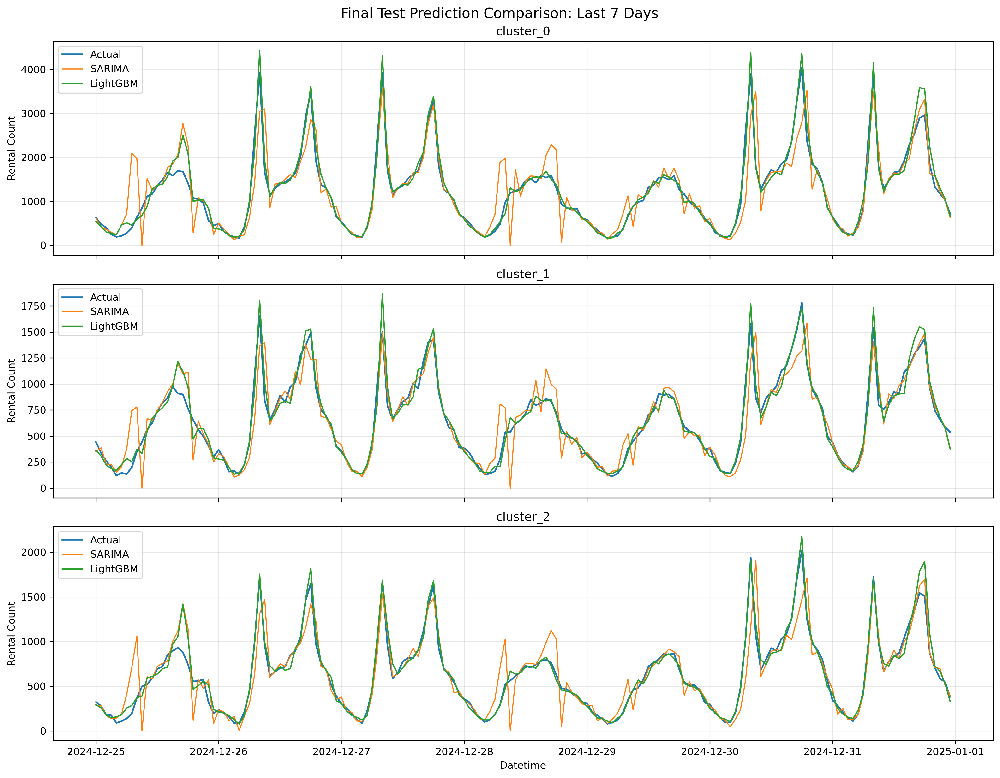
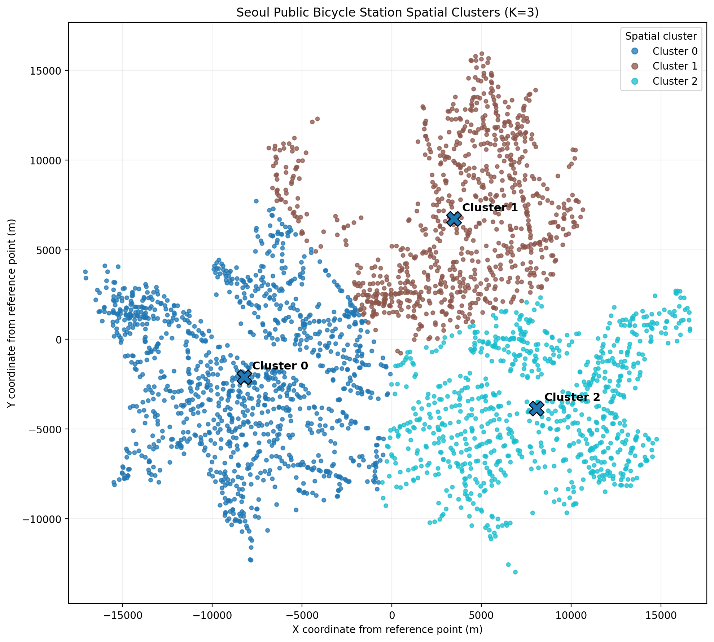
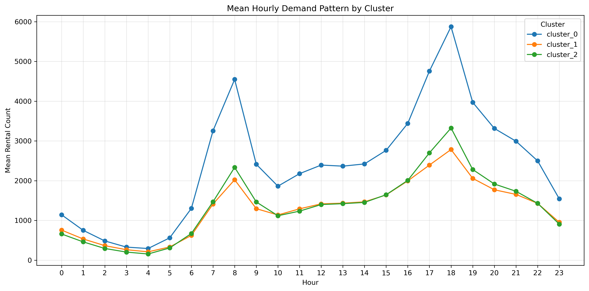
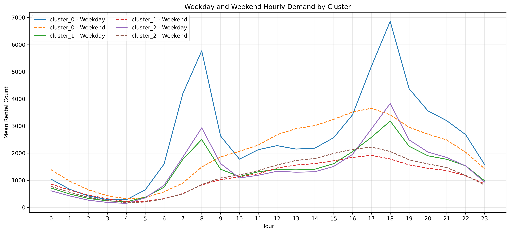
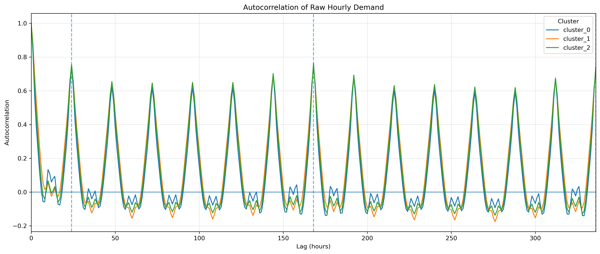

# 서울시 공공자전거 GPS 군집 기반 수요 예측

서울시 공공자전거 대여소를 GPS 좌표에 따라 공간 군집화하고, 각 군집의 다음 1시간 대여 수요를 예측한 시계열 데이터 분석 프로젝트입니다.

2023년 1월부터 2024년 12월까지의 시간대별 이용정보를 바탕으로 Hourly Naive, Daily Naive, Weekly Naive, SARIMA, LightGBM을 동일한 테스트 기간에서 비교했습니다.

## 핵심 결과

| 항목                  | 결과                                  |
| ------------------- | ----------------------------------- |
| 분석 기간               | 2023-01-01 00:00 ~ 2024-12-31 23:00 |
| 예측 단위               | GPS 기반 공간 군집별 1시간 대여건수              |
| 최종 군집 수             | 3개                                  |
| 최종 데이터              | 52,632행, 17,544시간                   |
| 원천 이용 건수(집계 전)       | 88,708,877건                         |
| 최종 우수 모델            | LightGBM                            |
| LightGBM Macro RMSE | 190.724                             |
| LightGBM Macro MAE  | 113.054                             |
| SARIMA 대비 RMSE 개선율  | 58.595%                             |
| SARIMA 대비 MAE 개선율   | 56.520%                             |
| Hourly Naive 대비 RMSE 개선율 | 73.714%                         |



---

## 1. 프로젝트 배경

공공자전거 수요는 시간대, 요일, 최근 이용량과 지역적 특성에 따라 크게 달라집니다.

서울시 전체 수요를 하나의 값으로 예측하면 지역별 차이를 반영하기 어렵고, 개별 대여소 단위로 각각 모델을 만들면 분석 단위가 지나치게 세분화될 수 있습니다.

이 프로젝트에서는 대여소의 위도와 경도를 이용해 공간적으로 가까운 대여소를 군집화한 뒤, 각 군집의 시간당 수요를 예측하는 구조를 설계했습니다.

### 분석 목표

1. 대여소 ID와 GPS 좌표의 품질을 점검합니다.
2. K-Means를 이용해 대여소를 공간 군집으로 분류합니다.
3. 군집별 시간당 대여건수를 생성합니다.
4. 시간 순서를 유지하여 학습·검증·테스트 데이터를 분리합니다.
5. 나이브 기준모델, SARIMA, LightGBM의 예측 성능을 비교합니다.
6. 데이터 누출을 방지한 1시간 앞 예측 조건에서 최종 성능을 평가합니다.

---

## 2. 사용 데이터

### 2.1 원천 데이터

| 데이터                 | 활용 목적                 |
| ------------------- | --------------------- |
| 서울시 공공자전거 시간대별 이용정보 | 대여소별 시간당 대여건수 집계      |
| 서울시 공공자전거 대여소 정보    | 대여소 ID, 이름, 위도, 경도 확인 |
| 대여소 정보 이력           | 대여소 ID 및 좌표 정합성 보완    |

분석 기간은 다음과 같습니다.

```text
2023-01-01 00:00:00
~
2024-12-31 23:00:00
```

대용량 원천 데이터는 저장소에 포함하지 않습니다. 필요한 데이터 배치 방법은 [`data/README.md`](data/README.md)에서 확인할 수 있습니다.

### 2.2 최종 모델링 데이터

원천 이용 건수 총 88,708,877건을 군집 × 시간 단위로 집계하여, 최종 모델링 데이터는 52,632행으로 구성했습니다. 세부 구조는 다음과 같습니다.

| 항목      |          값 |
| ------- | ---------: |
| 행 수     |     52,632 |
| 고유 시간 수 |     17,544 |
| 군집 수    |          3 |
| 시간 간격   |        1시간 |
| 총 대여건수  | 88,708,877 |

군집별 총 대여건수는 다음과 같습니다.

| 군집          |   시간 수 |     총 대여건수 |
| ----------- | -----: | ---------: |
| `cluster_0` | 17,544 | 42,011,493 |
| `cluster_1` | 17,544 | 22,855,516 |
| `cluster_2` | 17,544 | 23,841,868 |

---

## 3. 분석 파이프라인

```text
원천 이용정보 및 대여소 데이터
            ↓
대여소 ID 표준화와 좌표 품질 점검
            ↓
공간 분석 대상·제외 대여소 분리
            ↓
GPS 좌표 표준화 및 K-Means 후보 평가
            ↓
최종 K=3 공간 군집 선정
            ↓
군집 × 시간 단위 대여건수 집계
            ↓
탐색적 분석과 자기상관 진단
            ↓
시간 순서 기반 학습·검증·테스트 분할
            ↓
Hourly Naive / Daily Naive / Weekly Naive / SARIMA / LightGBM
            ↓
군집별 RMSE·MAE 및 Macro Average 비교
```

---

## 4. 데이터 품질 관리

### 4.1 대여소 ID 정합성

이용정보와 대여소 마스터의 ID 형식 차이를 줄이기 위해 대여소 ID를 표준화했습니다.

* 문자열과 숫자형 ID 형식 통일
* 앞자리 0과 불필요한 문자열 처리
* 하나의 표준 ID에 여러 원본 ID가 연결되는지 확인
* 이용정보와 대여소 마스터 간 결합 여부 검증

### 4.2 GPS 좌표 검증

공간 군집화 전에 다음 좌표를 분석 대상에서 제외했습니다.

* 위도·경도 결측치
* 0으로 기록된 좌표
* 서울시 분석 범위를 벗어난 좌표
* 대여소 정보 이력과 최신 정보가 충돌하는 좌표

분석 대상과 제외 대상의 행 수 및 대여건수는 별도의 감사 파일로 기록하여 분리 전후 합계가 보존되는지 검증했습니다.

### 4.3 데이터 품질 의심 구간

`2023-09-07 08:00~10:00`에는 세 군집 모두에서 수요가 조건부 정상 수준의 약 1% 이하로 동시에 하락한 뒤 11시부터 회복했습니다.

이 현상은 우선 확인이 필요한 데이터 품질 의심 구간으로 기록했습니다.

* 확인되지 않은 원인을 단정하지 않았습니다.
* 값을 임의로 삭제하거나 보간하지 않았습니다.
* 원자료를 유지한 상태로 최종 모델링에 포함했습니다.

관련 결과는 다음 파일에서 확인할 수 있습니다.

```text
outputs/metrics/priority_2023_09_07_context.csv
```

---

## 5. GPS 기반 공간 군집화

대여소의 위도와 경도를 표준화한 뒤 K-Means를 적용했습니다.

군집 수는 처음부터 3개로 고정하지 않고 여러 K 후보를 비교했습니다.

### 평가 기준

* Inertia
* Silhouette score
* 군집별 대여소 수
* 군집 간 공간적 분리
* 결과의 해석 가능성

정량적 지표와 공간 분포를 함께 검토하여 최종 군집 수를 `K=3`으로 선택했습니다.



후보별 결과는 다음 파일에서 확인할 수 있습니다.

```text
outputs/metrics/spatial_cluster_candidate_metrics.csv
outputs/metrics/spatial_clustering_final_summary.csv
outputs/metrics/spatial_clustering_final_validation.csv
```

---

## 6. 탐색적 데이터 분석

군집별 수요 패턴을 다음 관점에서 확인했습니다.

* 월별 수요 변화
* 시간대별 수요 패턴
* 평일과 주말의 차이
* 직전 시간과의 단기 연속성
* 전일 같은 시간의 반복성
* 전주 같은 요일·시간의 반복성





자기상관 분석 결과를 바탕으로 SARIMA의 24시간 계절 주기와 LightGBM의 시차 변수를 구성했습니다.



---

## 7. 데이터 분할

시계열의 미래 정보를 과거 학습 구간에 포함하지 않도록 무작위 분할을 사용하지 않았습니다.

| 구간  | 기간                                  |
| --- | ----------------------------------- |
| 학습  | 2023-01-01 00:00 ~ 2024-06-30 23:00 |
| 검증  | 2024-07-01 00:00 ~ 2024-09-30 23:00 |
| 테스트 | 2024-10-01 00:00 ~ 2024-12-31 23:00 |

모델 구조와 하이퍼파라미터는 학습·검증 구간에서 확정했습니다. 테스트 결과를 확인한 뒤 모델 설정을 다시 변경하지 않았습니다.

최종 평가에서는 학습 데이터와 검증 데이터를 합친 45,504행으로 모델을 다시 학습하고, 테스트 6,624행에서 성능을 측정했습니다.

학습 구간 39,384행과 검증 구간 6,624행의 단순 합은 46,008행이지만, 168시간 시차 변수(`lag_168`)를 생성하는 과정에서 각 군집의 초기 168시간이 결측으로 제외되어 최종 학습 행 수는 45,504행이 됩니다. 이는 미래 정보가 과거 예측에 사용되지 않도록 시차 변수를 엄격히 적용한 결과입니다.

---

## 8. 비교 모델

### 8.1 Hourly Naive

직전 1시간의 실제 수요를 다음 예측값으로 사용합니다. 시계열에서 가장 단순하면서도 강력한 기준선으로, 직전 시점의 정보만으로 어느 정도까지 예측이 가능한지를 보여줍니다.

```text
prediction(t) = actual(t - 1)
```

### 8.2 Daily Naive

전일 같은 시간의 실제 수요를 다음 예측값으로 사용합니다.

```text
prediction(t) = actual(t - 24)
```

### 8.3 Weekly Naive

전주 같은 요일·시간의 실제 수요를 다음 예측값으로 사용합니다.

```text
prediction(t) = actual(t - 168)
```

### 8.4 SARIMA

두 후보를 검증 구간에서 비교했습니다.

| 후보       | order       | seasonal_order  |
| -------- | ----------- | --------------- |
| SARIMA A | `(1, 0, 0)` | `(1, 1, 0, 24)` |
| SARIMA B | `(1, 0, 1)` | `(1, 1, 0, 24)` |

최종 모델은 SARIMA B입니다.

```text
order = (1, 0, 1)
seasonal_order = (1, 1, 0, 24)
```

Python 구현에는 `statsmodels`의 `SARIMAX` 클래스를 사용했습니다. 외생변수를 입력하지 않았으므로 실제 모델 구조는 SARIMA입니다.

### 8.5 LightGBM

세 군집의 데이터를 하나로 결합한 단일 LightGBM 회귀모델을 학습했습니다. `cluster_id`를 입력 변수에 포함하여 군집별 수요 차이를 하나의 모델에서 학습하도록 구성했습니다.

최종 입력 변수는 다음 11개입니다.

```text
cluster_id
hour
weekday
month
is_weekend
lag_1
lag_2
lag_3
lag_24
lag_48
lag_168
```

주요 설정은 다음과 같습니다.

| 설정               |     값 |
| ---------------- | ----: |
| Learning rate    |  0.05 |
| 최대 트리 수          | 1,000 |
| Number of leaves |    31 |
| Maximum depth    |     8 |
| Early stopping   |   50회 |
| 최적 반복 횟수         |  921회 |
| Random state     |    42 |

모든 시차 변수는 예측 시점보다 이전에 관측된 실제 수요만 이용해 생성했습니다.

---

## 9. 최종 테스트 성능

평가 지표는 RMSE와 MAE입니다.

각 군집의 성능을 먼저 계산한 뒤, 세 군집을 동일한 비중으로 평균한 Macro Average를 최종 모델 비교에 사용했습니다.

| 순위 | 모델           | Macro RMSE | Macro MAE |
| -: | ------------ | ---------: | --------: |
|  1 | LightGBM     |    190.724 |   113.054 |
|  2 | SARIMA       |    460.629 |   260.015 |
|  3 | Hourly Naive |    725.571 |   456.731 |
|  4 | Weekly Naive |    776.525 |   427.048 |
|  5 | Daily Naive  |    865.435 |   464.011 |

LightGBM은 SARIMA와 비교하여 다음과 같이 오차를 줄였습니다.

* RMSE 개선율: `58.595%`
* MAE 개선율: `56.520%`

직전 1시간을 그대로 사용하는 가장 단순한 기준선(Hourly Naive)을 포함한 나이브 모델과의 비교 결과는 다음과 같습니다.

| 비교 대상        | RMSE 개선율 | MAE 개선율 |
| ------------ | -------: | ------: |
| Hourly Naive |  73.714% | 75.247% |
| Weekly Naive |  75.439% | 73.527% |
| Daily Naive  |  77.962% | 75.636% |

가장 강력한 단순 기준선인 Hourly Naive와 비교해도 LightGBM은 RMSE를 73.714% 줄였습니다. 직전 시간 수요가 변수 중요도 1위(65.741%)임에도 직전 값을 그대로 사용하는 방식만으로는 한계가 분명하며, 모델이 시간대·요일·장기 반복 패턴을 함께 결합해 학습했음을 보여줍니다.

### LightGBM 군집별 성능

| 군집          |    RMSE |     MAE |
| ----------- | ------: | ------: |
| `cluster_0` | 300.230 | 174.359 |
| `cluster_1` | 131.507 |  82.274 |
| `cluster_2` | 140.436 |  82.529 |

`cluster_0`은 다른 군집보다 총수요와 변동성이 커 절대 오차인 RMSE도 상대적으로 높게 나타났습니다.

---

## 10. 변수 중요도

LightGBM의 gain 기반 변수 중요도 상위 변수는 다음과 같습니다.

| 변수        |     중요도 |
| --------- | ------: |
| `lag_1`   | 65.741% |
| `lag_168` | 18.672% |
| `lag_24`  |  7.187% |
| `hour`    |  3.943% |

직전 시간 수요가 가장 중요한 변수였으며, 전주 같은 시간과 전일 같은 시간의 수요도 주요 예측 정보로 활용됐습니다.

변수 중요도는 예측 기여도를 나타내는 지표이며, 해당 변수가 수요 변화를 직접 일으킨다는 인과관계를 의미하지 않습니다.

---

## 11. 프로젝트 구조

```text
.
├── .gitignore
├── config.yaml
├── README.md
├── requirements.txt
├── data/
│   ├── README.md
│   ├── raw/
│   │   └── .gitkeep
│   └── processed/
│       ├── README.md
│       ├── cluster_hourly_demand.csv
│       └── station_cluster_map.csv
├── notebooks/
│   ├── 01_data_quality_preprocessing.ipynb
│   ├── 02_spatial_clustering_analysis.ipynb
│   └── 03_modeling_evaluation.ipynb
└── outputs/
    ├── README.md
    ├── figures/
    │   └── 대표 그래프 10개
    └── metrics/
        └── 핵심 지표 14개
```

노트북을 실행하면 로컬 환경에 중간 그래프, 상세 지표, 전체 예측값과 학습 모델이 추가로 생성됩니다. 재현 가능한 대용량·중간 산출물은 `.gitignore`를 통해 공개 저장소에서 제외합니다.

---

## 12. 주요 산출물

### 최종 처리 데이터

```text
data/processed/station_cluster_map.csv
data/processed/cluster_hourly_demand.csv
```

### 대표 시각화

```text
outputs/figures/spatial_station_clusters_k3.png
outputs/figures/integrated_hourly_demand_by_cluster.png
outputs/figures/integrated_weekday_weekend_demand_by_cluster.png
outputs/figures/integrated_raw_demand_acf.png
outputs/figures/sarima_validation_last_week.png
outputs/figures/lightgbm_validation_last_week.png
outputs/figures/final_test_model_comparison_last_week.png
```

### 최종 평가 결과

```text
outputs/metrics/final_model_config.csv
outputs/metrics/final_sarima_fit_summary.csv
outputs/metrics/final_test_metrics.csv
outputs/metrics/final_test_macro_ranking.csv
outputs/metrics/final_test_improvement_summary.csv
outputs/metrics/lightgbm_feature_importance.csv
```

전체 공개 산출물에 대한 설명은 [`outputs/README.md`](outputs/README.md)에서 확인할 수 있습니다.

---

## 13. 실행 방법

### 13.1 저장소 준비

```bash
git clone <repository-url>
cd seoul-bike-demand-forecasting
```

### 13.2 가상환경 생성

Windows PowerShell 기준입니다.

```powershell
python -m venv .venv
.\.venv\Scripts\Activate.ps1
```

### 13.3 패키지 설치

```powershell
python -m pip install --upgrade pip
pip install -r requirements.txt
```

### 13.4 원천 데이터 배치

원천 데이터는 저장소에 포함하지 않습니다.

[`data/README.md`](data/README.md)의 폴더 구조와 파일 배치 기준에 따라 데이터를 `data/raw/` 아래에 준비합니다.

### 13.5 노트북 실행

아래 순서대로 실행합니다.

```text
1. notebooks/01_data_quality_preprocessing.ipynb
2. notebooks/02_spatial_clustering_analysis.ipynb
3. notebooks/03_modeling_evaluation.ipynb
```

앞 단계에서 생성한 파일을 다음 노트북이 입력으로 사용하므로 실행 순서를 변경하지 않습니다.

---

## 14. 결과 해석 시 주의사항

* 예측 대상은 개별 대여소가 아니라 GPS 기반 공간 군집입니다.
* 예측 시점은 다음 1시간입니다.
* LightGBM은 세 군집을 결합한 단일 모델입니다.
* SARIMA는 군집별로 별도 학습했습니다.
* SARIMA의 음수 예측값은 대여건수의 정의에 맞게 0으로 조정했습니다.
* 미래 실측 기상값은 실제 예측 시점에 알 수 없으므로 입력 변수로 사용하지 않았습니다.
* 별도의 미래 기상예보 데이터도 최종 데이터에 포함하지 않았습니다.
* 변수 중요도는 예측 기여도이며 인과관계를 의미하지 않습니다.
* 일부 대표 그래프는 마지막 1주만 보여주므로 전체 성능은 테스트 기간 전체의 CSV 지표를 기준으로 확인해야 합니다.

---

## 15. 한계와 개선 방향

### 현재 한계

1. 공간 단위가 개별 대여소가 아닌 3개 군집으로 단순화되어 있습니다.
2. 테스트 기간이 2024년 4분기로 제한되어 있습니다.
3. 공휴일, 행사, 미래 기상예보 등 외부 변수를 사용하지 않았습니다.
4. 군집별 수요 규모 차이 때문에 절대 오차의 직접 비교에는 주의가 필요합니다.
5. `2023-09-07 08:00~10:00`의 공통 저수요 현상에 대한 외부 원인은 확인하지 못했습니다.

### 향후 개선 방향

1. 대여소 단위 또는 더 세분화된 공간 격자 단위 예측
2. Rolling-origin 방식의 다기간 시계열 검증
3. 공휴일·행사·미래 기상예보 데이터 결합
4. Poisson, Tweedie 등 비음수 수요 분포를 고려한 목적함수 비교
5. SHAP을 활용한 군집·시간대별 예측 해석
6. 수요예측 결과를 재배치 우선순위와 연결하는 운영 의사결정 확장

---

## 16. 결론

GPS 기반 공간 군집화와 시간 순서 기반 검증을 결합하여 서울시 공공자전거의 군집별 다음 1시간 수요를 예측했습니다.

최종 테스트에서 LightGBM은 Macro RMSE `190.724`, Macro MAE `113.054`를 기록했으며, SARIMA보다 RMSE를 `58.595%`, MAE를 `56.520%` 줄였습니다.

직전 시간, 전일 같은 시간, 전주 같은 요일·시간의 수요가 핵심 예측 정보로 활용됐으며, 공공자전거 수요에서 단기 연속성과 반복 패턴을 함께 학습하는 비선형 모델의 효과를 확인했습니다.

특히 직전 1시간을 그대로 사용하는 가장 단순한 기준선과 비교해도 LightGBM은 RMSE를 73.714% 줄여, 단순 반복성만으로는 설명되지 않는 예측 성능을 확보했습니다.